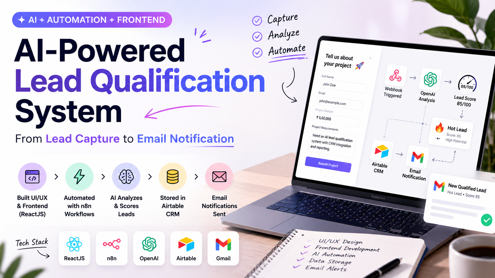
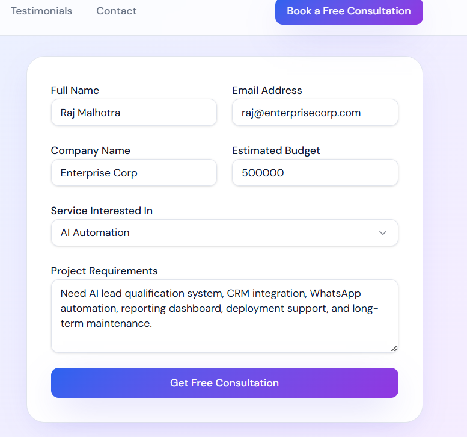
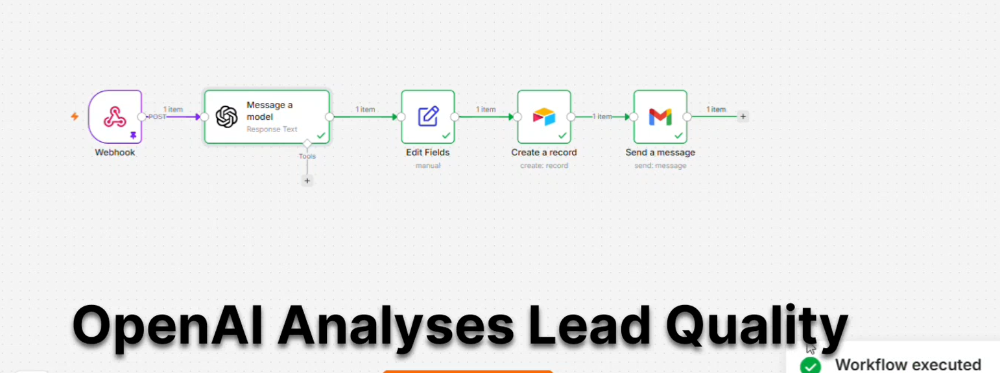
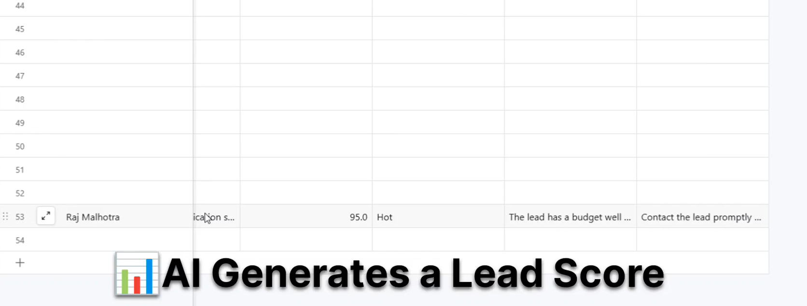
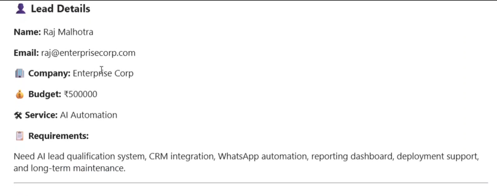

# AI-Powered Lead Qualification System

A practical project demonstrating how UI/UX Design, Frontend Development, AI Automation, and Workflow Orchestration can work together in a real business use case.

---

## Project Overview

This project automates the lead qualification process by analyzing incoming leads, assigning a score, classifying them as Hot/Warm/Cold, storing them in a CRM, and sending automated notifications.

---

## Problem

Businesses often receive leads through forms, but manually reviewing, qualifying, and prioritizing every lead can be time-consuming.

This process can delay follow-ups and impact conversion opportunities.

---

## Solution

I designed and implemented an AI-powered workflow that:

- Captures leads through a custom interface
- Analyzes lead quality using AI
- Generates lead scores
- Classifies leads as Hot, Warm, or Cold
- Stores qualified leads in Airtable CRM
- Sends automated email notifications

---

## My Role

- UI/UX Design
- Frontend Development (ReactJS)
- OpenAI Integration
- Workflow Automation (n8n)
- Airtable CRM Setup
- Email Automation

---

## Workflow

Lead Form
↓
Webhook Trigger
↓
OpenAI Analysis
↓
Lead Scoring
↓
Lead Classification
↓
Airtable CRM
↓
Email Notification

---

## Screenshots

### Lead Capture Interface

---

### Workflow Automation

---

### Airtable CRM

---

### Email Notification

---

## Tech Stack

- ReactJS
- JavaScript
- OpenAI
- n8n
- Airtable
- Gmail
- Webhooks

---

## Key Learning

One of the biggest learnings from this project was realizing that AI isn't the hard part—defining clear business rules and context is.

Small changes in prompts and qualification criteria had a significant impact on the consistency and accuracy of the results.

---

## Future Enhancements

- WhatsApp Notifications
- Analytics Dashboard
- Follow-up Automation
- Multi-Agent Lead Qualification
